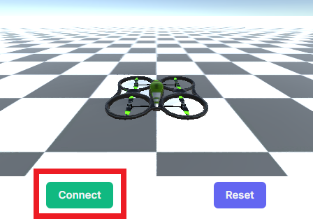

# Ubicoders Virtual Robot - Multirotor

Requirements:
- Python 3
- ubicoders-vrobots pip packge

## Once you have Python 3,

```
pip install ubicoders-vrobots
```

## Turn on Virtual Robots Bridge
```
python -c "import ubicoders_vrobots_bridge.vrobots_bridge_gui as gui; gui.gui_app_run()"
```

## Connect the Virtual Robot 


## Run the tempalte script
```
python my_vrobot.py
```